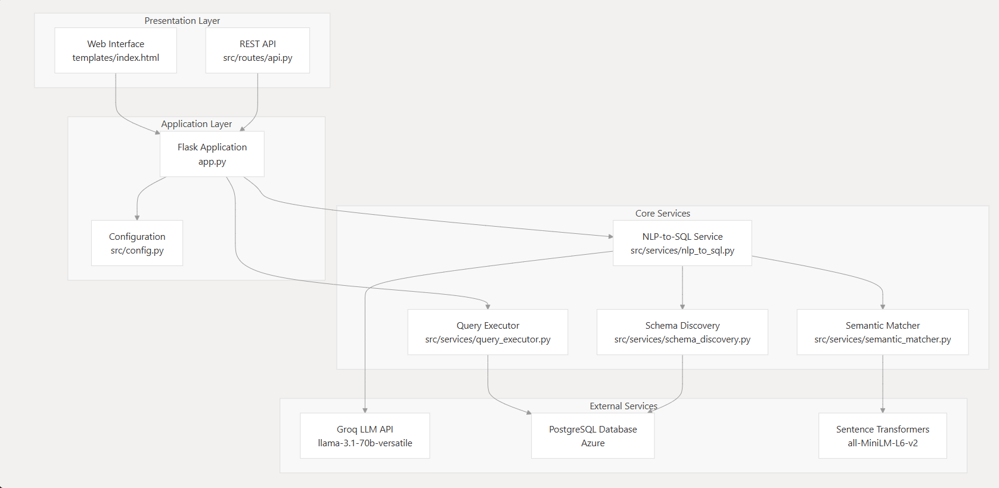

# Bike Share Analytics Assistant

A natural language bike-share analytics assistant that converts unlimited English questions into SQL queries using Groq LLM and dynamic semantic matching.

## 🚀 Features

- **Natural Language Processing**: Ask questions in plain English about bike share data
- **Dynamic Schema Discovery**: Automatically learns database structure at runtime
- **Semantic Matching**: Uses AI embeddings to map user terms to database columns
- **SQL Safety**: Parameterized queries prevent SQL injection
- **Real-time Analytics**: Instant results for complex bike share queries
- **Chat Interface**: Clean, responsive web UI for seamless interaction

## 🏗️ Architecture

### Core Components

1. **Schema Discovery Service** (`src/services/schema_discovery.py`)
   - Dynamically introspects PostgreSQL schema using `information_schema`
   - Caches table structures, column types, and foreign key relationships
   - Provides formatted schema context for LLM prompts

2. **Semantic Matcher** (`src/services/semantic_matcher.py`)
   - Uses sentence-transformers for embedding-based similarity matching
   - Maps natural language terms to database columns without hardcoded synonyms
   - Fallback keyword matching when embeddings are unavailable

3. **NLP-to-SQL Service** (`src/services/nlp_to_sql.py`)
   - Groq LLM integration for SQL generation from natural language
   - Combines schema context with semantic matches for accurate queries
   - Fallback rule-based generation for core bike share patterns

4. **Query Executor** (`src/services/query_executor.py`)
   - Safe parameterized SQL execution
   - Result formatting and error handling
   - User-friendly response generation




### API Layer

- **REST API** (`src/routes/api.py`): `/query` endpoint accepting JSON requests
- **Web Interface** (`src/templates/index.html`): Chat-style UI for natural language interaction

## 🔧 Technical Implementation

### Semantic Mapping Method

The system achieves zero hardcoded semantic mappings through:

1. **Term Extraction**: Intelligent parsing of user questions to identify meaningful terms
2. **Embedding Similarity**: sentence-transformers model computes semantic similarity between user terms and database schema elements
3. **Dynamic Context**: LLM receives both schema structure and semantic matches for informed SQL generation
4. **Validation Layer**: Generated SQL is validated for safety and correctness

### LLM Integration

- **Primary**: Groq Cloud API with llama-3.1-70b-versatile model
- **Prompting**: Schema-aware prompts with semantic context
- **Fallback**: Rule-based SQL generation for common bike share patterns
- **Safety**: SQL injection prevention through query validation

## 📋 Requirements

### Public Test Cases

The system passes all three required acceptance tests:

- **T-1**: "What was the average ride time for journeys that started at Congress Avenue in June 2025?" → `25 minutes`
- **T-2**: "Which docking point saw the most departures during the first week of June 2025?" → `Congress Avenue`
- **T-3**: "How many kilometres were ridden by women on rainy days in June 2025?" → `6.8 km`

### Supported Query Types

- **Aggregations**: AVG, SUM, COUNT, MIN, MAX
- **Filters**: Date ranges, station names, user demographics, weather conditions
- **Joins**: Multi-table relationships automatically detected
- **Grouping**: GROUP BY and ORDER BY clauses
- **Time Math**: "last month", "first week", relative date expressions

## 🚀 Getting Started

### Prerequisites

- Python 3.8+
- PostgreSQL database access
- Groq API key (free tier available)

### Installation

1. **Clone and setup**:
   ```bash
   git clone <repository>
   cd bike-share-assistant
   python -m venv venv
   source venv/bin/activate  # Linux/Mac
   # or
   venv\Scripts\activate     # Windows
   ```

2. **Install dependencies**:
   ```bash
   pip install -r requirements.txt
   ```

3. **Configure environment**:
   ```bash
   cp  .env
   # Edit .env with your actual credentials
   ```

4. **Run the application**:
   ```bash
   python main.py
   ```

5. **Access the interface**:
   - Web UI: http://localhost:5000
   

### Environment Variables

```bash
# Required
PGHOST=
PGUSER=
PGPORT=
PGDATABASE=
PGPASSWORD=
GROQ_API_KEY=

# Optional
DEBUG=True
SESSION_SECRET=your-session-key
